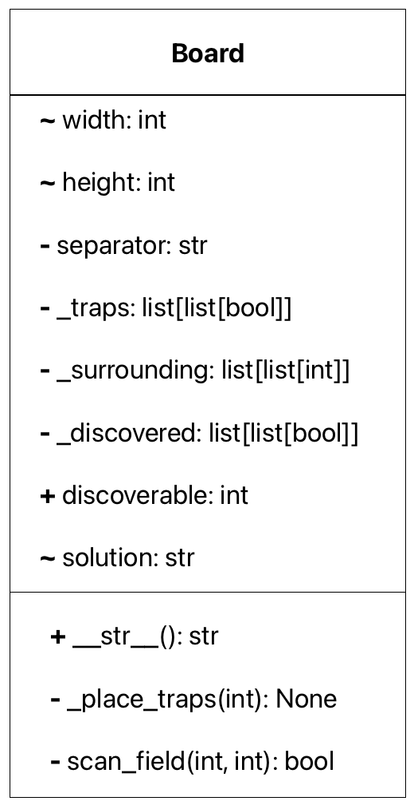
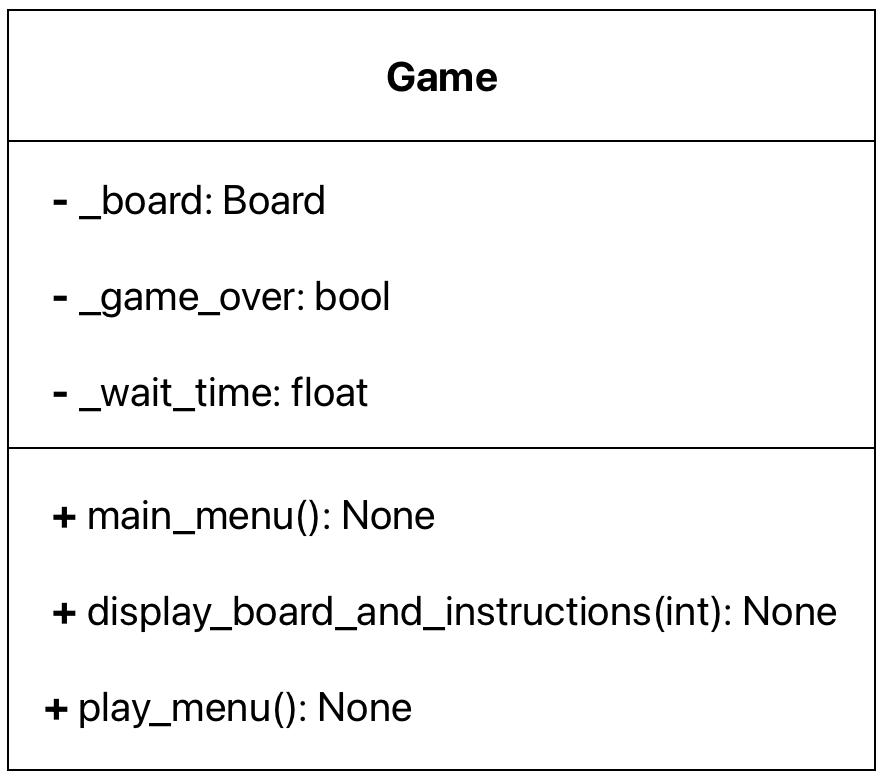
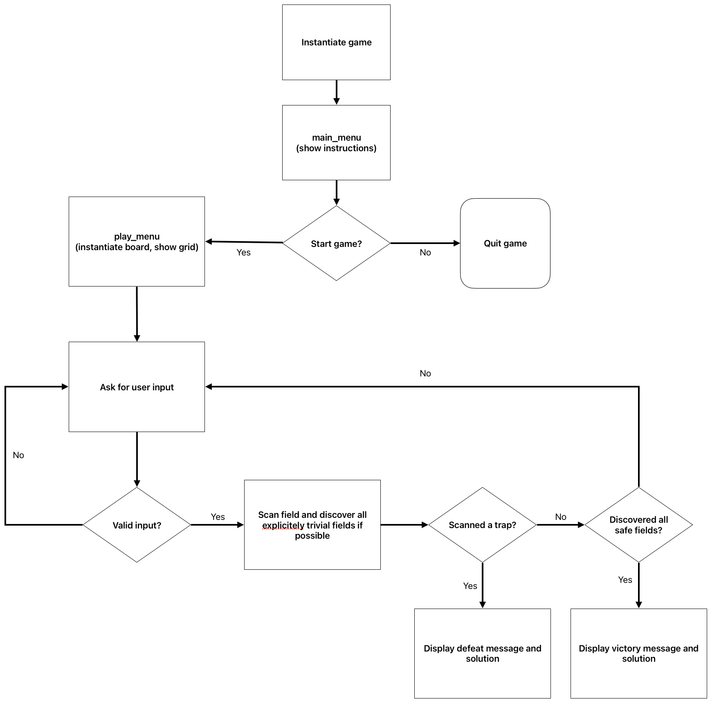

# Abandoned Space Station

Lukas Richter, TIK24

## Table of Contents

- [Abandoned Space Station](#abandoned-space-station)
  - [Table of Contents](#table-of-contents)
  - [Project structure and Features](#project-structure-and-features)
    - [Requirements and Dependencies](#requirements-and-dependencies)
    - [Architecture](#architecture)
      - [`source`](#source)
    - [User Interface](#user-interface)
    - [Program Flow](#program-flow)
    - [User Interface Walkthrough](#user-interface-walkthrough)
      - [Edge Cases](#edge-cases)
  - [Metrics](#metrics)
    - [MyPy](#mypy)
    - [pylint](#pylint)
    - [Coverage \& Unittests](#coverage--unittests)

## Project structure and Features
The game "Abandoned Space Station" is a logic game played in the console. The player must explore the zones, or cells, of a space station. The space station is represented as a grid of zones. In the zones, there may be traps. In order to explore the zones, the player can select zones that he wants to scan.

However, if there is a trap in the zone, the player will be killed and the game will be over. Otherwise, the scan will reveal the number of traps in the adjacent zones, i.e. diagonally and orthogonally neighboring zones. The player must logically deduce the positions of the traps and select the zones to scan accordingly.
The game ends when the player has successfully scanned all safe zones without triggering any traps. In this case, the player wins the game.  
Note: In the following elaborations, the terms "zone", "field" and "cell" all refer to the board's atomic grid units.

### Requirements and Dependencies
The project is written in Python 3.13.1 and uses the following modules:
- `unittest` for testing purposes
- `random` for generating random numbers (used in the Board generation)
- `os` for file operations (mainly used to create the PYTHONPATH)
- `sys` for system operations (used for setting the PYTHONPATH in order to use the project's modules)

A complete list of all dependencies can be found in the `requirements.txt` file.

### Architecture
The project is structured as follows:
~~~console
.
├── documentation
│   ├── doc.md
│   ├── doc.pdf
│   ├── image-1.png
│   ├── image-2.png
│   └── image.png
├── source
│   ├── __init__.py
│   ├── board.py
│   ├── game.py
│   ├── helpers.py
│   └── main.py
├── tests
│   ├── htmlcov
│   ├── __init__.py
│   ├── __main__.py
│   ├── .coverage
│   ├── profile_output.pstats
│   ├── test_board.py
│   ├── test_game.py
│   ├── test_helpers.py
│   └── test_main.py
├── .coverage
├── .gitignore
├── .pylintrc
├── Bewertung.xlsx
├── exam.pdf
├── mypy.ini
├── README.md
└── requirements.txt
~~~

`mypy.ini` contains the configuration for the mypy type checker specified in the exam task statement.  
`.pylintrc` sets up 4 different pylint customizations whose purpose is documented directly in the configuration file.

The `source` directory contains the main game logic, while the `tests` directory contains the test cases for the project. The `documentation` directory contains the documentation for the project.

The project follows the object-orientied programming paradigm, implementing the following classes:
- `Board`: This class contains the state of the board and the logic for scanning fields
- `Game`: This class contains the game logic and the main game loop. It uses the `Board` class to manage the board state.
- One class inheriting from the `unittest.TestCase` class for each of the source modules, containing the test cases for the respective module.

#### `source`
As mentioned, this directory contains the main game logic.

The `main.py` module is the entry point of the program. It contains the `play` function, which is called when the program is executed. The `play` function creates an instance of the `Game` class, which starts the game.

The `helpers.py` module contains two helper functions that are used by the other modules. Those helper functions are `clear` and `wait`. The `clear` function clears the console, and the `wait` function waits for a specified amount of time.

For the sake of simplicity, implementation diagrams display protected attributes with corresponding property methods as well as stand-alone property methods as protected attributes. Furthermore, even though python technically only supports public attributes, the convention of using a single underscore prefix for protected attributes and a double underscore prefix for private attributes is followed.

`board.py` implements the `Board` class (as visualized above), which contains the state of the board and the logic for scanning fields. The `Board` class has a magic method `__str__` that returns a string representation of the board. This string is used to print the board to the console during the game, when the user has not yet won or lost.  
Additionally, this class also implements properties to access the private attributes `_width` and `_height` from outside the class, and another property that returns a string representation of the board's solution.  
The `scan_field` method is used to scan a field on the board. It takes the coordinates of the field as arguments and returns a Boolean indicating whether the zone contains a trap or not. Furthermore, it updates the number of still discoverable safe zones (i.e. those that have not been scanned before) and the information about which specific fields have been discovered. It also accounts for the case of fields that do not contain any traps, in which case it applies the flood fill algorithm to discover all adjacent fields that do not contain any traps. This is performed because it is guaranteed that all adjacent fields are safe and it would be trivial for the user to scan those fields.

`game.py` implements the `Game` class conceptualized above, which contains the game logic and the main game loop. The relation between the `Game`and `Board` is a composition, with the `Game` class containing an instance of the `Board` class.  
The user's entry point is a console menu generated by the `main_menu` method. This menu instructs the user about the game's rules and objective. It prompts the user to press `y`to start a new game or `n` to quit the application.  
Pressing `y` will call the `play_menu` method, which is responsible for starting the game, processing user input, and updating the game state. After each user input, the method ensures it validity and prompts the user to enter a new input if the previous one was invalid. Once it receives a valid input, it updates the game state and displays the updated board.  
If the user chooses to scan a trapped field, the game will end with a game over message and the board's solution. If he scans the last undiscovered field, the game will end with a victory message.  
If neither is the case, the method simply updates the board and prompts the user for the next input.

### User Interface
The main menu has the following design:
~~~console
Welcome to the abandoned space station game!
You are an astronaut on an abandoned space station.
Be careful, the station is full of traps and hazards.

Your mission is to find locate all all safe zones on the station, while avoiding the traps.

Unfortunately, your means of communicating with the ground station are limited.
Your only tool is a scanner that can detect the presence of traps around you.
However, that means you need to be inside the zone that you want to scan, so you must be careful not to step on any traps.
If you step on a trap, you will be killed and the game will be over.

Do you want to start the game? (y/n) 
~~~
If the user enters `n`, the game will end. If the user enters `y`, the game will start and the play menu with the initially empty board will be displayed:
~~~console
Here is the map of the space station:
    0   1   2   3   4  
  |---|---|---|---|---|
0 | ? | ? | ? | ? | ? | 
  |---|---|---|---|---|
1 | ? | ? | ? | ? | ? | 
  |---|---|---|---|---|
2 | ? | ? | ? | ? | ? | 
  |---|---|---|---|---|
3 | ? | ? | ? | ? | ? | 
  |---|---|---|---|---|
4 | ? | ? | ? | ? | ? | 
  |---|---|---|---|---|
5 | ? | ? | ? | ? | ? | 
  |---|---|---|---|---|
6 | ? | ? | ? | ? | ? | 
  |---|---|---|---|---|
7 | ? | ? | ? | ? | ? | 
  |---|---|---|---|---|

Question marks represent cells that you have not scanned yet.
Numbers represent the number of traps around the cell.

Let's start!
Enter the row and column of the cell you want to scan (e.g. 1 2):
~~~

The user can then enter a command. It must adhere to the format `row column`, where `row` and `column` are integers indicating the grid cell to be scanned. The game will then reveal the cell and update the grid:

~~~console
Here is the map of the space station:
    0   1   2   3   4   
  |---|---|---|---|---|
0 | ? | ? | ? | ? | ? | 
  |---|---|---|---|---|
1 | ? | ? | 1 | 1 | 1 | 
  |---|---|---|---|---|
2 | ? | 1 | 1 | 0 | 0 | 
  |---|---|---|---|---|
3 | ? | 1 | 0 | 0 | 0 | 
  |---|---|---|---|---|
4 | ? | 2 | 1 | 0 | 0 | 
  |---|---|---|---|---|
5 | ? | ? | 2 | 1 | 1 | 
  |---|---|---|---|---|
6 | ? | ? | ? | ? | ? | 
  |---|---|---|---|---|
7 | ? | ? | ? | ? | ? | 
  |---|---|---|---|---|

Question marks represent cells that you have not scanned yet.
Numbers represent the number of traps around the cell.

Let's start!
Enter the row and column of the cell you want to scan (e.g. 1 2): 
~~~

If the user enters a cell that contains a trap, the game will end and the user will lose. The following examples of the output will only have a placeholder for the grid for readability resons:

~~~console
Oh no, you stepped on a trap! Game over.

The solution was:
<solution grid>

You'll automatically return to the main menu in 5 seconds.
~~~

A winning game in which the player has discovered all safe fields will look like this:

~~~console
Congratulations! You have found all the safe cells!

The final solution is:
<solution grid>

You'll automatically return to the main menu in 5 seconds.
~~~

### Program Flow
### User Interface Walkthrough
1. **Main Menu**: The user is greeted with an introduction and prompted to start the game.
2. **Game Start**: If the user chooses to start, the game initializes the board and displays it.
3. **User Input**: The user enters the row and column to scan.
4. **Game Logic**: The game processes the input, updates the board, and checks for game over conditions.
5. **Game Over/Win**: Depending on the outcome, the game displays a victory or defeat message and returns to the main menu.

$\longrightarrow$
#### Edge Cases
- **Invalid Input Handling**: The game handles invalid inputs by prompting the user to enter valid data.
- **Scanning the Last Safe Cell**: The game detects when the last safe cell is scanned and declares victory.
- **Scanning a previously scanned cell again**: The `scan_field` method of the `Board` immediately returns `True` without any further scanning procedures, indicating the player did not select a trapped cell, without changing the board or the state of the game.

Program flow diagram:  

More in-depth explanations are contained directly in the source code, both for the unittests and actual game source code.

## Metrics
### MyPy
MyPy does not raise any errors or warnings:
~~~console
(.venv) lukas@MacBook-Pro-2 exam % mypy .
Success: no issues found in 11 source files
~~~

### pylint
Pylint returns a 10/10 rating:
~~~console
(.venv) lukas@MacBook-Pro-2 exam % pylint source tests

--------------------------------------------------------------------
Your code has been rated at 10.00/10 (previous run: 10.00/10, +0.00)
~~~

### Coverage & Unittests
The project has 98% overall testtest coverage, with no single file below 91%. The console snippet below shows a shortened version of the unittest results:
~~~console
ok
test_clear (tests.test_helpers.TestHelpers.test_clear)
Test that the clear function calls the correct system command. ... ok
test_wait (tests.test_helpers.TestHelpers.test_wait)
Test that the wait function waits approximately the correct amount of time. ... ok
test_play (tests.test_main.TestMain.test_play)
Test the play function ... ok
test_pythonpath (tests.test_main.TestMain.test_pythonpath)
Test that PYTHONPATH is set correctly ... ok

----------------------------------------------------------------------
Ran 20 tests in 2.039s

OK
~~~

Below is the coverage report:

<!DOCTYPE html>
<html lang="en">
    <head>
        <meta http-equiv="Content-Type" content="text/html; charset=utf-8">
        <title>Coverage report</title>
        <link rel="icon" sizes="32x32">
        <link rel="stylesheet">
        
    </head>
    <body class="indexfile">
        <header>
            

                <h3>Coverage report:
                    98%
                </h1>
                <h4>
                        <a class="button current">Files</a>
                </h2>
                

                    <a class="nav">coverage.py v7.8.0</a>,
                    created at 2025-04-07 21:02 +0200
                

            

        </header>
        <main id="index">
            <table class="index" data-sortable>
                <thead>
                    <tr class="tablehead" title="Click to sort">
                        <th id="file" class="name left" aria-sort="none" data-shortcut="f">File</th>
                        <th id="statements" aria-sort="none" data-default-sort-order="descending" data-shortcut="s">statements</th>
                        <th id="missing" aria-sort="none" data-default-sort-order="descending" data-shortcut="m">missing</th>
                        <th id="excluded" aria-sort="none" data-default-sort-order="descending" data-shortcut="x">excluded</th>
                        <th id="coverage" class="right" aria-sort="none" data-shortcut="c">coverage</th>
                    </tr>
                </thead>
                <tbody>
                    <tr class="region">
                        <td class="name left"><a>source/__init__.py</a></td>
                        <td>0</td>
                        <td>0</td>
                        <td>0</td>
                        <td class="right" data-ratio="0 0">100%</td>
                    </tr>
                    <tr class="region">
                        <td class="name left"><a>source/board.py</a></td>
                        <td>109</td>
                        <td>2</td>
                        <td>0</td>
                        <td class="right" data-ratio="107 109">98%</td>
                    </tr>
                    <tr class="region">
                        <td class="name left"><a>source/game.py</a></td>
                        <td>78</td>
                        <td>0</td>
                        <td>0</td>
                        <td class="right" data-ratio="78 78">100%</td>
                    </tr>
                    <tr class="region">
                        <td class="name left"><a>source/helpers.py</a></td>
                        <td>10</td>
                        <td>0</td>
                        <td>0</td>
                        <td class="right" data-ratio="10 10">100%</td>
                    </tr>
                    <tr class="region">
                        <td class="name left"><a>source/main.py</a></td>
                        <td>11</td>
                        <td>1</td>
                        <td>0</td>
                        <td class="right" data-ratio="10 11">91%</td>
                    </tr>
                    <tr class="region">
                        <td class="name left"><a>tests/__init__.py</a></td>
                        <td>0</td>
                        <td>0</td>
                        <td>0</td>
                        <td class="right" data-ratio="0 0">100%</td>
                    </tr>
                    <tr class="region">
                        <td class="name left"><a>tests/__main__.py</a></td>
                        <td>6</td>
                        <td>0</td>
                        <td>0</td>
                        <td class="right" data-ratio="6 6">100%</td>
                    </tr>
                    <tr class="region">
                        <td class="name left"><a>tests/test_board.py</a></td>
                        <td>66</td>
                        <td>1</td>
                        <td>0</td>
                        <td class="right" data-ratio="65 66">98%</td>
                    </tr>
                    <tr class="region">
                        <td class="name left"><a>tests/test_game.py</a></td>
                        <td>84</td>
                        <td>3</td>
                        <td>0</td>
                        <td class="right" data-ratio="81 84">96%</td>
                    </tr>
                    <tr class="region">
                        <td class="name left"><a>tests/test_helpers.py</a></td>
                        <td>24</td>
                        <td>1</td>
                        <td>0</td>
                        <td class="right" data-ratio="23 24">96%</td>
                    </tr>
                    <tr class="region">
                        <td class="name left"><a>tests/test_main.py</a></td>
                        <td>21</td>
                        <td>1</td>
                        <td>0</td>
                        <td class="right" data-ratio="20 21">95%</td>
                    </tr>
                </tbody>
                <tfoot>
                    <tr class="total">
                        <td class="name left">Total</td>
                        <td>409</td>
                        <td>9</td>
                        <td>0</td>
                        <td class="right" data-ratio="400 409">98%</td>
                    </tr>
                </tfoot>
            </table>
        </main>
    </body>
</html>

